# Classified Group Interface for Directus

[](https://www.npmjs.com/package/directus-extension-classified-group)

A group to which a class can be assigned for custom styling.

```sh
# Install via npm
npm install directus-extension-classified-group
# Install via yarn
yarn add directus-extension-classified-group
# Install via pnpm
pnpm add directus-extension-classified-group
```

## Examples

<details><summary>Example 1: Change spacing between fields</summary>

1. Add a classified group
   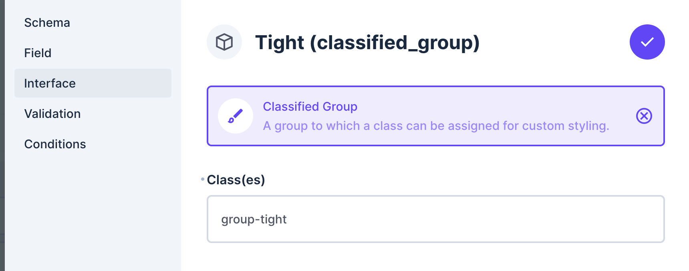

2. Add fields
   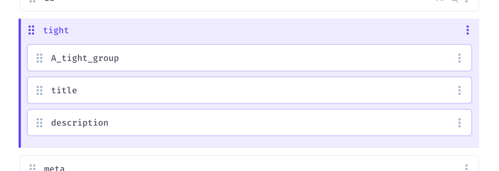

3. Add Custom CSS in the Project Settings
   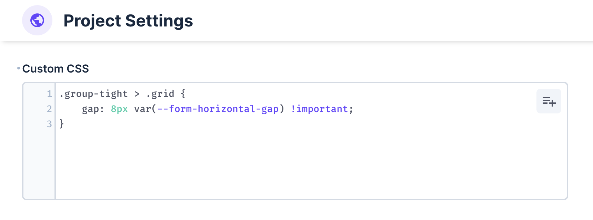

4. Result
   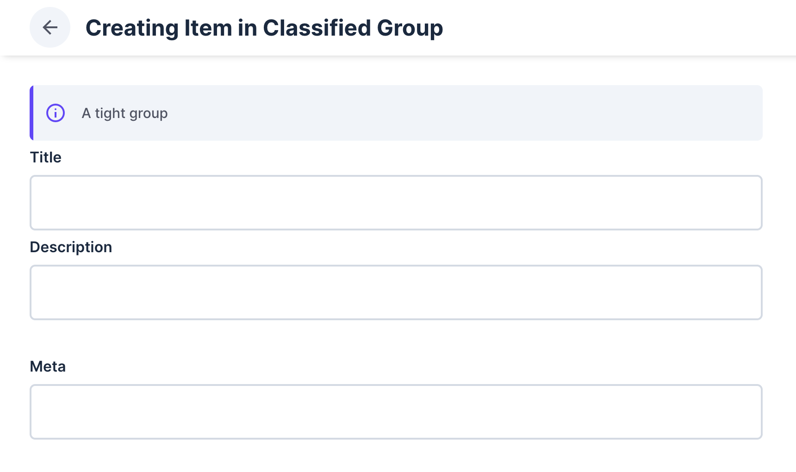

</details>

<details><summary>Example 2: Add a border around fields</summary>

1. Add a classified group
   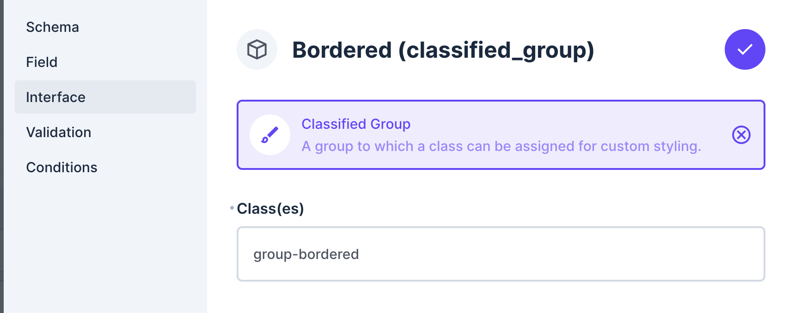

2. Add fields
   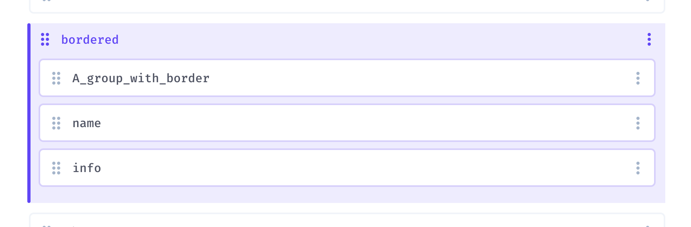

3. Add Custom CSS in the Project Settings
   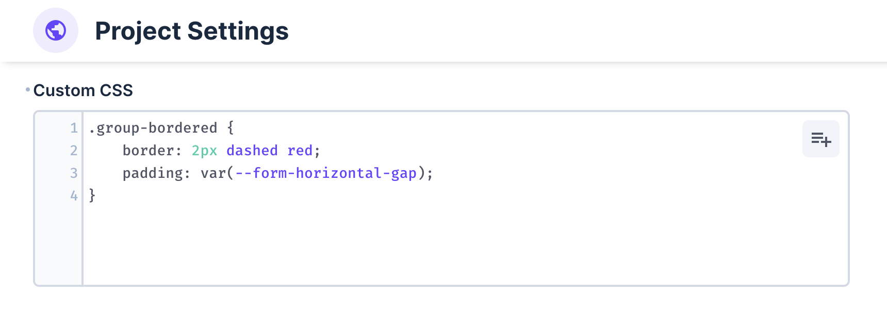

4. Result
   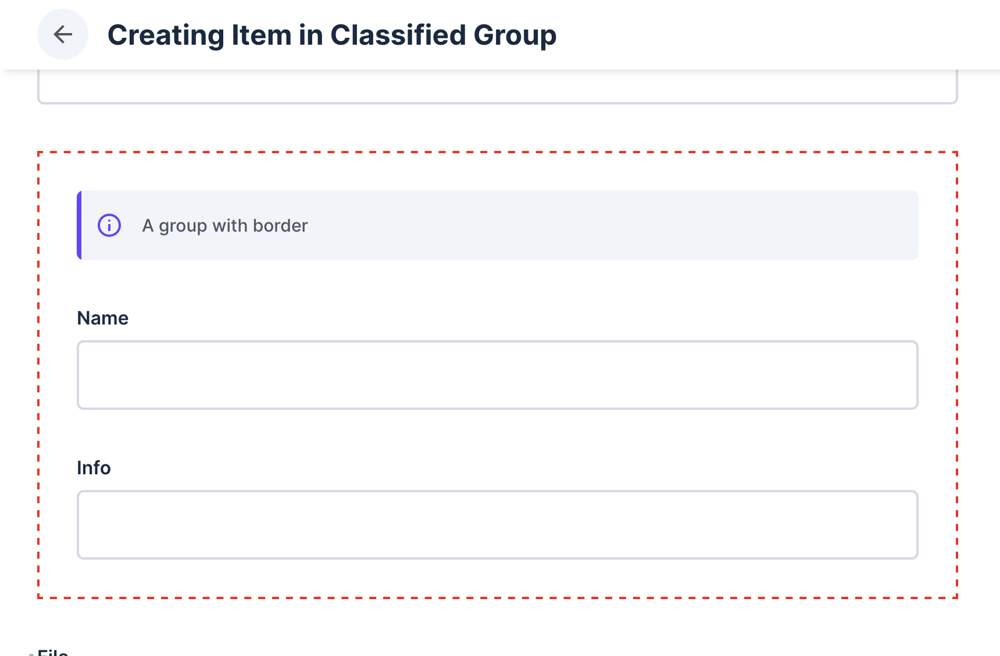

</details>

<details><summary>Example 3: Place fields at the top of the directus_files collection</summary>

1. Add a classified group
   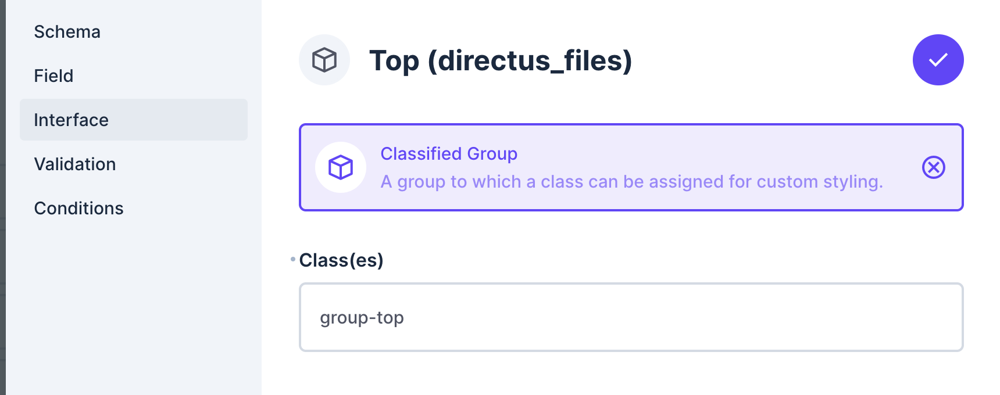

2. Add fields
   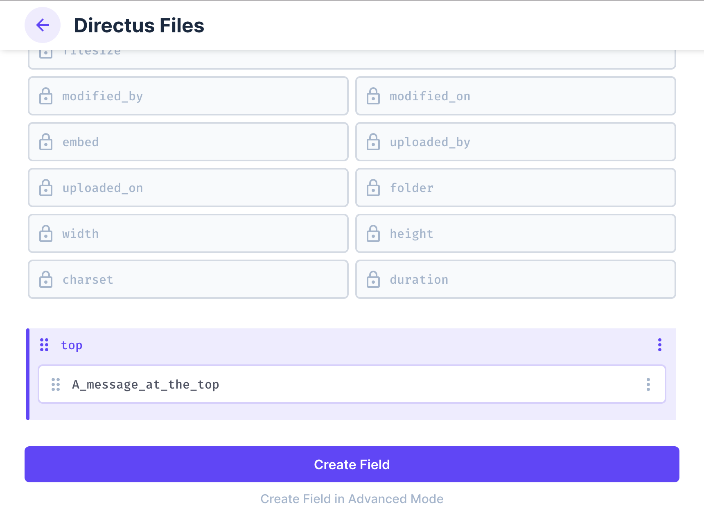

3. Add Custom CSS in the Project Settings
   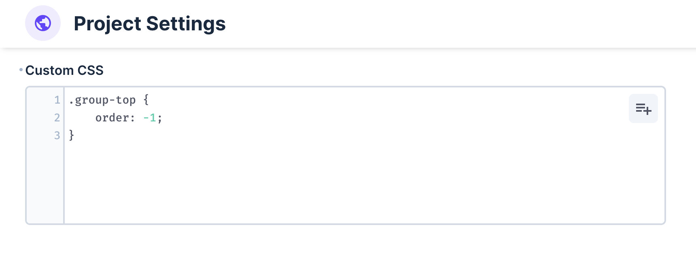

4. Result
   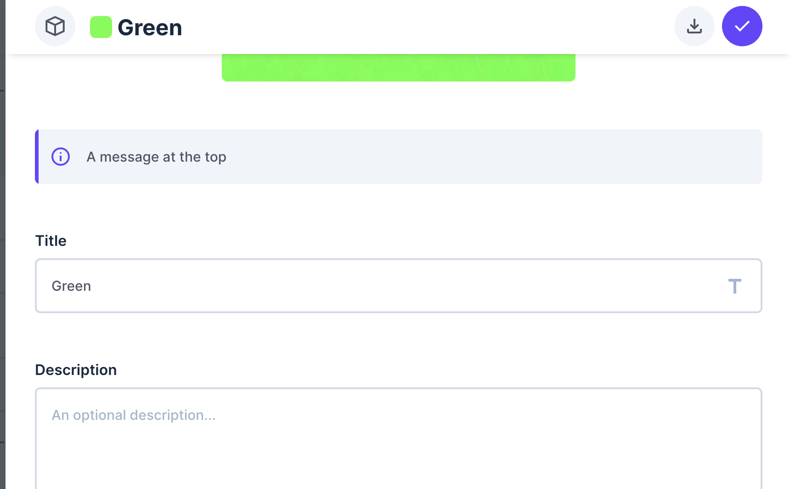

</details>
